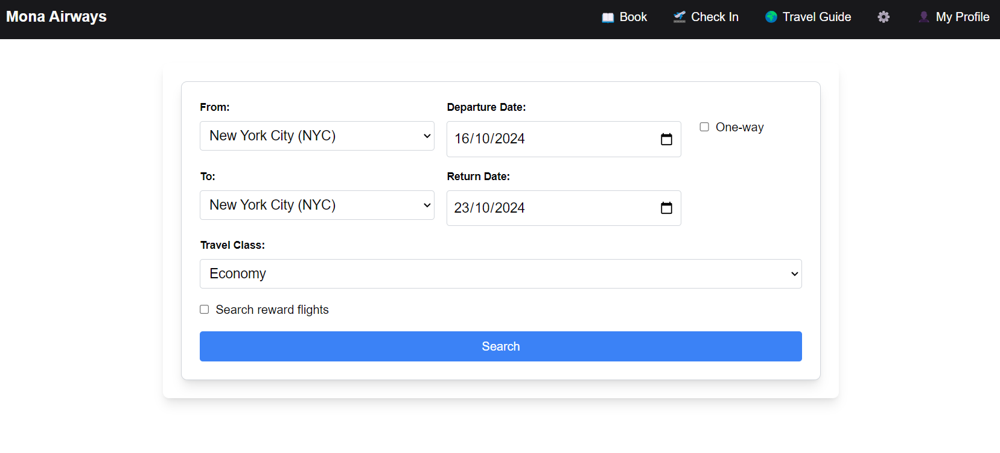
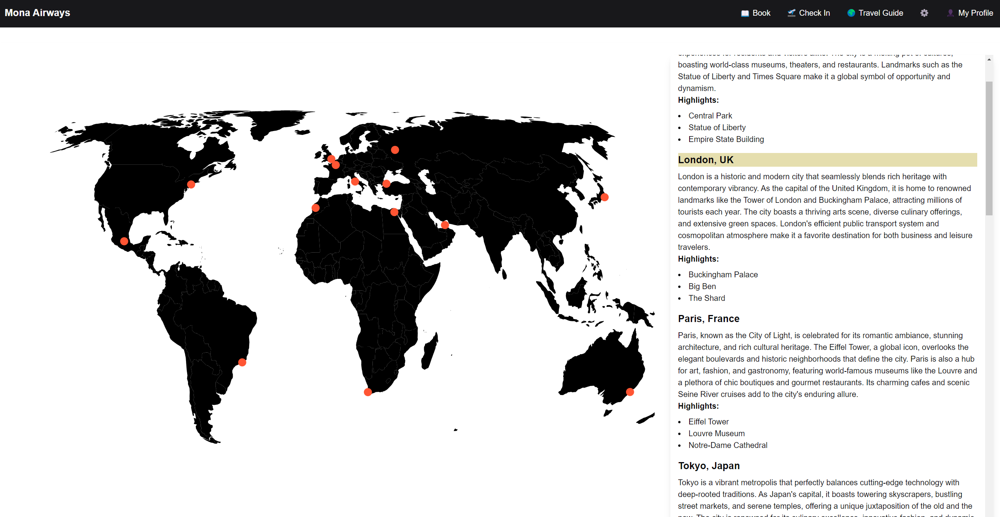
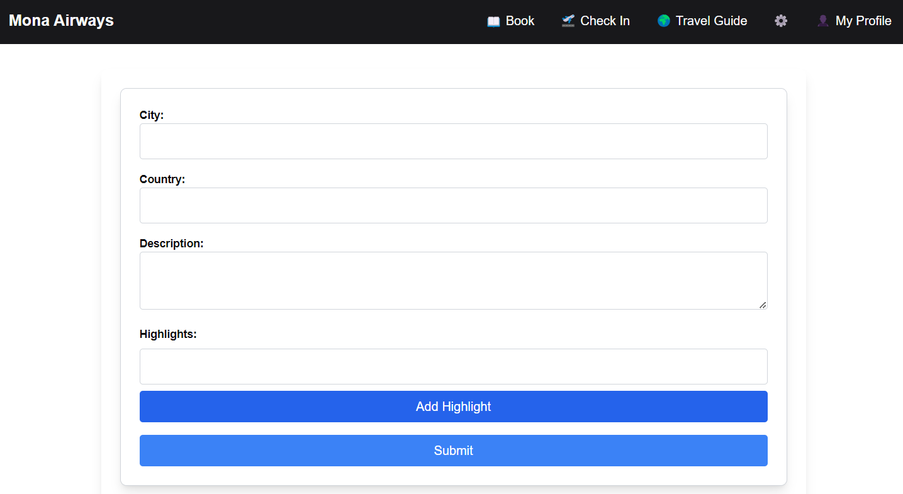
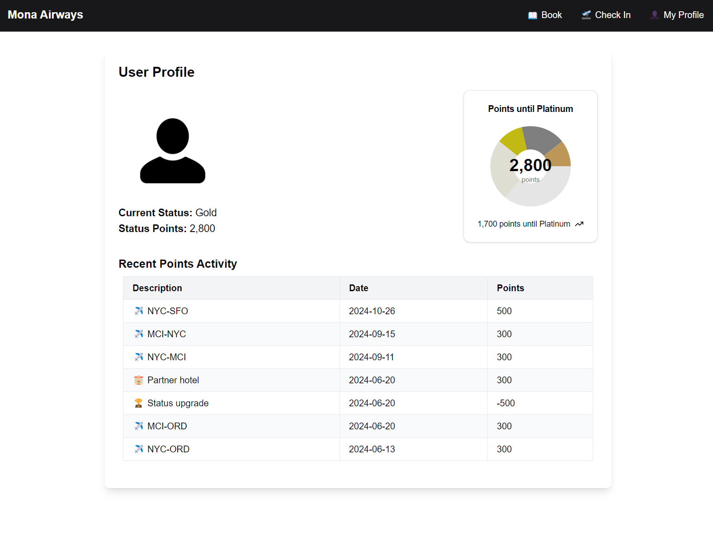

This is the website for Mona Airways. Fly with the Octocat!

## Getting Started

First, install from npm

```bash
npm install
```

Then run the development server:

```bash
npm run dev
```

Open [http://localhost:3000](http://localhost:3000) with your browser to see the result.

## Features

### Home Page - Book Your Flight

The homepage now provides the flight booking functionality, with the following options:

- **Round Trip:** Search for flights between two locations with departure and return dates
- **One Way:** Search for flights from origin to destination with a single departure date
- **Multi-City:** Plan complex itineraries with up to 5 flight segments

Additional features include:
- Customizable search options for cabin class and number of passengers
- Option to search for reward flights only
- Interactive flight search results showing:
  - Flight details (airline, flight number, departure/arrival times)
  - Price or reward points required
  - Number of stops and connecting airports
  - Total duration

The feature uses synthetic data to simulate flight search results without requiring an actual API connection. Flight data is cached using a cache-aside pattern to provide a consistent experience, with identical searches returning the same results.



### Find My Booking

The "Find My Booking" page allows users to retrieve and view their booking information by entering their confirmation code and last name. Features include:

- Simple verification with confirmation code (format CA######) and last name
- Detailed flight information display, including:
  - Flight details (airline, flight number, departure/arrival times, duration)
  - Price per passenger (or reward points required)
  - Passenger information
  - Baggage allowance based on cabin class
  - Travel guide information for the destination city
  - Check-in functionality (currently displays a message that check-in is not yet available)
  - Test credentials are provided on the form for demonstration purposes

The feature uses a mock database of bookings and supports case-insensitive search. The travel guide integration displays destination information from the existing travel guide database.


### Travel Guide Page

_Note: This page should function as expected_

Users should be able to:
- See a world map with pins on each city
- See a list of locations, descriptions, and highlights on the right (optional)
- Click on a pin on the map - this should highlight the appropriate city guide and scroll to it if it's not currently visible on the page
- (Alternatively) When a pin is clicked, show the appropriate city guide



## Map Implementation (React 19+)

The Travel Guide page now uses [react-leaflet](https://react-leaflet.js.org/) and [leaflet](https://leafletjs.com/) for map rendering, replacing the deprecated react-simple-maps. The map is styled to be minimal and non-interactive (no panning or zooming), and displays city markers based on the data in `CityGuideData`.

- The map uses GeoJSON boundaries from `public/map.json`.
- Markers are rendered for each city in the travel guide.
- Clicking a marker highlights the corresponding city guide.
- All map controls and interactions are disabled for a clean, static look.

**Dependencies:**
- `react-leaflet` (map rendering)
- `leaflet` (map engine)
- `@types/leaflet` (TypeScript support)

To update or customize the map, see `components/ui/TravelGuideMap.tsx` and `app/travelguide/page.tsx`.

## Travel Guide Admin Page

_Note: Only the UI and lat/long lookup should work on this page. No back-end functionality required._

⚠️ _Demo Note: We'll be asking Copilot Workspace to help add an image upload to this page. We only really need to see the UI end product, but expect other (e.g. data retrieval) files will need to change._

Users should be able to:
- Type a City and Country
- When both City and Country are filled, show the latitude and longitude for that city below. If invalid, show an error.
- Add a plain text long-form description for the city
- Add a list of travel highlights for the city (tourist attractions)



### Profile Page

_Note: This page should function as expected_

⚠️ _Demo Note: We will be using Copilot in VS Code to add a line graph showing monthly points changes below the table_

Users should be able to:
- See their profile picture, current status, and status points
- See a visualisation of their progress towards the next status level
- See a table of recent points activity



## Refactor: UI and Feature Components

On 24 April 2025, the following changes were made to improve code organization:

- **Moved feature-specific components** (`pointsActivityTable.tsx`, `flightBookingForm.tsx`, `travelGuideForm.tsx`, `TravelGuideMap.tsx`) from `components/ui/` to `components/`.
- **Updated all imports** in the codebase to reference the new locations.
- **Added tests** for these components in their new locations using React Testing Library.

This keeps the `ui` folder focused on reusable UI primitives, while feature-specific components are now in the main `components` folder. All functionality and tests remain unchanged.
